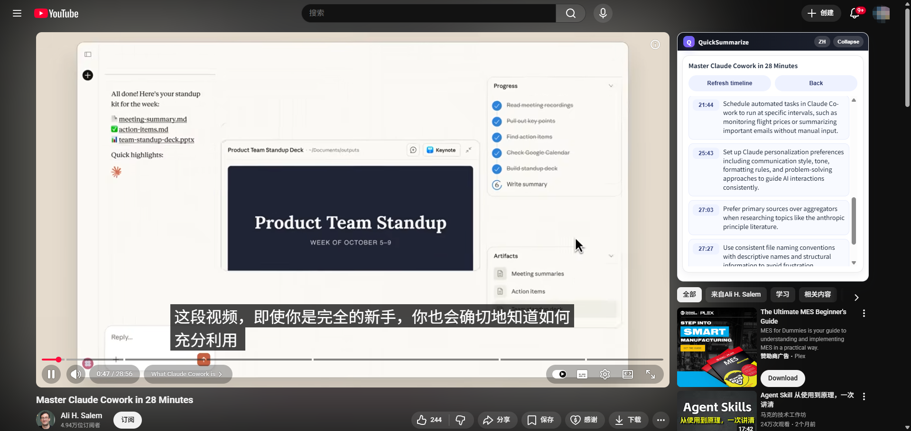

# QuickSummarize

[](LICENSE)

[中文说明](README.zh-CN.md)



QuickSummarize is an open-source Chrome extension that helps you summarize YouTube videos from subtitles.

It opens in Chrome Side Panel, fetches available caption data, and sends subtitle text to an OpenAI-compatible API to generate readable summaries.

Right now the product is focused on YouTube. Support for more platforms may be added over time.

## What It Does

- Generate AI summaries for YouTube videos
- Show timeline-based subtitle segments
- Export subtitles as SRT-formatted text files
- Support English and Chinese UI
- Work with OpenAI-compatible APIs

## Current Scope

- Platform support: YouTube only
- Browser support: Chrome / Chromium browsers with Side Panel support
- Distribution: source install only for now

I do not currently expect this project to be reliably accepted in the Chrome Web Store, so the recommended installation method is loading it in Developer Mode.

## How It Works

1. Open a YouTube video
2. Manually turn on captions in the player
3. Open the extension side panel
4. Generate a summary or export subtitles

By default, the extension does not try to open captions for you.

There is an optional setting to auto-try opening captions, but it is disabled by default because it may look like automation behavior to YouTube.

Automatic caption opening is not recommended because it may require the extension to interact with the YouTube player, trigger extra caption requests, and behave more like automation than a normal user action. That can make subtitle retrieval less stable and may increase the risk of being flagged by platform defenses.

For the safest workflow, manually turn on captions first, confirm they are visible on the video, and then use QuickSummarize.

## Install From Source

### 1. Clone the repository

```bash
git clone https://github.com/SlyPaws/QuickSummarize.git
cd QuickSummarize
```

### 2. Install dependencies

```bash
npm install
```

### 3. Build the extension

```bash
npm run build
```

### 4. Enable Developer Mode in Chrome

1. Open `chrome://extensions/`
2. Turn on `Developer mode` in the top-right corner

### 5. Load the extension manually

1. Click `Load unpacked`
2. Select the `extension` folder in this repository

## Install From Release

If you do not want to build locally, you can download a packaged archive from GitHub Releases.

1. Open the repository `Releases` page
2. Download the latest `quicksummarize-vX.Y.Z.zip`
3. Unzip it locally
4. Open `chrome://extensions/`
5. Turn on `Developer mode`
6. Click `Load unpacked`
7. Open the unzipped folder and select the inner `extension` folder that contains `manifest.json`

The release zip contains an `extension/` directory, so Chrome should be pointed to that inner folder after extraction.

## Release Workflow

This repository can publish release packages automatically.

When a tag like `v0.1.0` is pushed, GitHub Actions will:

1. Install dependencies
2. Run tests
3. Build the extension
4. Package the `extension` folder into a zip file
5. Attach that zip file to a GitHub Release

Example:

```bash
git tag v0.1.0
git push origin v0.1.0
```

## Initial Setup

After loading the extension:

1. Open the extension settings page
2. Fill in:
   - `API Base URL`
   - `Model`
   - `API Key`
   - `Language`
3. Save the configuration

Optional:

- Enable `Automatically try to open captions (risky)` only if you understand the risk of automation-like behavior

## Usage

### Summarize a video

1. Open a YouTube video page
2. Turn on captions manually in the YouTube player
3. Confirm captions are visible on the video
4. Open QuickSummarize
5. Click `Summarize`

### Export subtitles

1. Open a YouTube video page
2. Turn on captions manually in the YouTube player
3. Open QuickSummarize
4. Click `Export SRT (.txt)`

The export uses SRT content with a `.txt` filename.

## Notes

- Some videos do not provide usable captions
- Auto-generated captions depend on YouTube availability
- Summary quality depends on subtitle quality
- The extension sends subtitle text to your configured API provider

## Development

### Scripts

```bash
npm run build
npm test
npm run test:watch
```

### Project Structure

```text
QuickSummarize/
|- extension/        Chrome extension source
|- tests/            Vitest test suite
|- build.js          Extension build script
```

## Privacy Reminder

When you use summarization, subtitle text is sent to the API endpoint you configure.

Make sure you trust that provider before using the extension.

## License

This project is licensed under the GNU General Public License v3.0.

See `LICENSE` for the full text.
