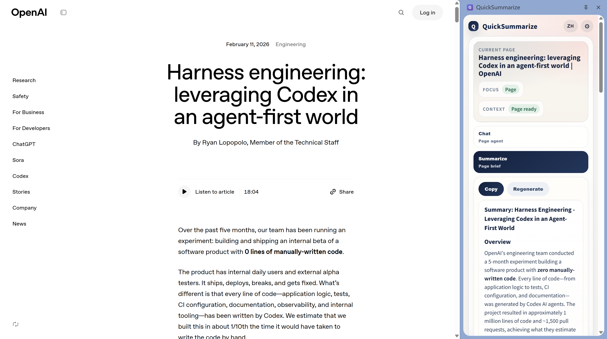
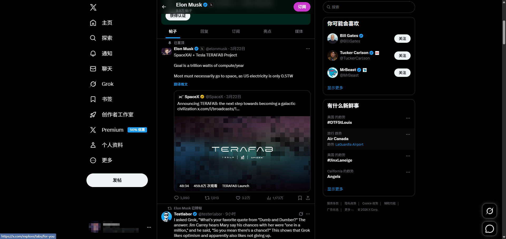
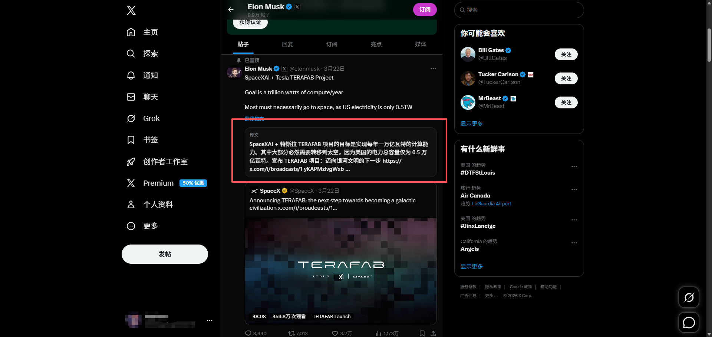

# QuickSummarize

[](LICENSE)

[English README](README.md)

QuickSummarize 是一个开源的 Chrome 扩展，可以在 Chrome Side Panel 中同时处理 YouTube 视频和普通网页内容。

它运行在 Chrome Side Panel 中，现在已经是一个会根据内容来源切换的工作区。在 YouTube 页面中，它走 transcript-first 工作流，支持总结、问答、时间线浏览和字幕导出；在普通网页中，它支持针对当前页面进行总结和对话。

当前版本支持 YouTube watch 页面以及普通 HTTP(S) 网页。

| 总览 | 网页 |
| --- | --- |
|  |  |
|  |  |

## 功能简介

- 为 YouTube 视频生成 AI 总结
- 在 transcript-first 工作区里针对当前视频提问
- 为普通网页生成总结
- 围绕当前网页或当前选中文本进行对话
- 查看按时间轴整理的 YouTube 字幕内容
- 导出 SRT 格式内容的 YouTube 字幕文本文件
- 支持中英文界面
- 支持 OpenAI 兼容接口
- 支持 Anthropic 风格接口

## 当前范围

- 平台支持：YouTube watch 页面 + 普通 HTTP(S) 网页
- 浏览器支持：支持 Side Panel 的 Chrome / Chromium 浏览器
- 分发方式：目前建议源码安装

我目前不太看好它能稳定通过 Chrome Web Store 审核，所以更推荐通过开发者模式手动安装。

## 使用逻辑

1. 打开 YouTube 视频或普通网页
2. 如果是 YouTube，先在播放器里手动打开字幕
3. 打开扩展侧边栏
4. 在工作区中生成总结、提问，并在可用时查看时间线或导出字幕

默认情况下，扩展不会主动帮你打开字幕。

设置页里提供了一个可选开关，可以让扩展尝试自动打开字幕，但它默认关闭，因为这种行为可能会被 YouTube 识别为自动化操作。

不建议自动打开字幕，因为这通常意味着扩展需要主动操作 YouTube 播放器、触发额外的字幕请求，让整体行为更像自动化脚本而不是正常用户操作。这会让字幕获取链路更不稳定，也可能增加被平台风控识别的风险。

更稳妥的使用方式是：先手动打开字幕，确认视频画面中已经显示字幕，再使用 QuickSummarize。

## 从源码安装

### 1. 克隆仓库

```bash
git clone https://github.com/EchoTide/QuickSummarize.git
cd QuickSummarize
```

### 2. 安装依赖

```bash
npm install
```

### 3. 构建扩展

```bash
npm run build
```

### 4. 打开 Chrome 开发者模式

1. 打开 `chrome://extensions/`
2. 在右上角开启 `开发者模式`

### 5. 手动加载扩展

1. 点击 `加载已解压的扩展程序`
2. 选择仓库中的 `extension` 目录

## 从 Release 安装

如果你不想在本地自己构建，也可以直接下载 GitHub Releases 里的打包产物。

1. 打开仓库的 `Releases` 页面
2. 下载最新的 `quicksummarize-vX.Y.Z.zip`
3. 在本地解压
4. 打开 `chrome://extensions/`
5. 开启 `开发者模式`
6. 点击 `加载已解压的扩展程序`
7. 打开解压后的目录，选择里面那个包含 `manifest.json` 的 `extension` 子目录

当前 release zip 里会包含一个 `extension/` 目录，所以在 Chrome 里加载时要选解压后的内部 `extension` 目录。

## 自动发布流程

仓库现在可以通过 GitHub Actions 自动发布打包产物。

当你推送类似 `v0.1.0` 的 tag 时，流程会自动：

1. 安装依赖
2. 运行测试
3. 构建扩展
4. 把 `extension` 目录打成 zip
5. 自动挂到 GitHub Release

示例：

```bash
git tag v0.1.0
git push origin v0.1.0
```

## 初始配置

加载完成后：

1. 打开扩展设置页
2. 填写以下信息：
   - `Provider`
   - `API Base URL`
   - `Model`
   - `API Key`
   - `Language`
3. 保存配置

Provider 说明：

- `OpenAI-compatible`：调用 `{baseUrl}/chat/completions`
- `Anthropic-style`：调用 `{baseUrl}/messages`，并按标准 Anthropic 风格 SSE 事件流解析返回

速度建议：

- 如果你使用 OpenAI 兼容接口，优先选择 `gpt-nano` 这一类更轻量、更快的模型，或同档位的小模型
- 如果你使用其他厂商，优先选择它们偏低延迟的 `flash` 类模型
- 更大的推理模型也能用，但在侧边栏里的总结和对话速度通常会明显更慢

可选项：

- 只有在你明确了解风险时，才开启 `自动尝试打开字幕（有风险）`
- 如果你想在划词后看到浮动翻译按钮，就开启 `Selection translation with DeepL`
- 填入你自己的 DeepL Key，并按需指定固定目标语言
- 翻译功能需要单独开通 DeepL API；它不会复用你上面配置的 LLM 接口 Key

## 使用方法

当 YouTube 视频可用时，侧边栏会提供一个 transcript-first 工作区，包含三种模式：

- `总结`：生成或重新生成视频总结
- `对话`：通过 transcript-first 智能体针对当前视频提问
- `分段总结 / 时间线`：查看字幕片段并按需刷新

当普通网页可用时，侧边栏会提供一个网页工作区，包含：

- `总结`：总结当前网页或当前选中文本
- `对话`：基于当前网页内容进行问答

### 生成视频总结

1. 打开 YouTube 视频页面
2. 先在 YouTube 播放器里手动打开字幕
3. 确认视频画面中已经显示字幕
4. 打开 QuickSummarize
5. 点击 `生成总结`

### 针对当前视频提问

1. 打开 YouTube 视频页面
2. 先在 YouTube 播放器里手动打开字幕
3. 确认视频画面中已经显示字幕
4. 打开 QuickSummarize
5. 切换到 `对话` 标签
6. 输入你想问的问题

当前对话模式以字幕内容为主。总结结果可以帮助快速建立上下文，但回答时的主要事实来源仍然是 transcript。

### 生成网页总结

1. 打开一篇文章、博客、文档或其他可读网页
2. 如果你希望只围绕某一段内容总结，可以先选中文本
3. 打开 QuickSummarize
4. 点击 `生成总结`

### 针对当前网页提问

1. 打开普通网页
2. 如果你希望对话聚焦某一段内容，可以先选中文本
3. 打开 QuickSummarize
4. 切换到 `对话` 标签
5. 输入你想问的问题

网页对话模式会以当前网页内容为事实基础；如果存在选中文本，会优先围绕选中内容回答。它不会使用 YouTube 专属的时间线或时间戳能力。

### 划词翻译

1. 打开普通网页或 YouTube 页面
2. 选中一段文本
3. 等待选区附近出现浮动工具条
4. 点击 `Translate`

DeepL 配置说明：

- 你需要在扩展设置页里填入自己的 DeepL API Key
- 只有普通 DeepL 网站账号还不够，翻译功能需要可用的 DeepL API 权限
- 免费 API Key 会自动走 DeepL free endpoint，付费 API Key 会自动走标准 endpoint

### 查看时间线

1. 打开 YouTube 视频页面
2. 先在 YouTube 播放器里手动打开字幕
3. 打开 QuickSummarize
4. 切换到 `分段总结 / 时间线`，或在总结面板中点击 `分段总结`
5. 如有需要，点击刷新

### 导出字幕

1. 打开 YouTube 视频页面
2. 先在 YouTube 播放器里手动打开字幕
3. 打开 QuickSummarize
4. 点击 `导出字幕（.txt）`

导出的文件内容是 SRT 格式，但文件后缀是 `.txt`。

## 说明

- 部分视频可能没有可用字幕
- 自动生成字幕取决于 YouTube 是否提供
- 总结和问答质量都依赖字幕质量
- 部分网页可能提取不到足够稳定的正文内容
- 扩展会把字幕文本发送到你配置的模型服务
- 当你总结或对话普通网页时，扩展会把提取到的网页文本发送到你配置的模型服务
- 只有在你明确点击浮动翻译按钮时，扩展才会把选中文本发送给 DeepL
- 视频问答以 transcript 为主要事实来源

## 开发

### 常用命令

```bash
npm run build
npm test
npm run test:watch
```

### 项目结构

```text
QuickSummarize/
|- extension/        Chrome 扩展源码
|- tests/            Vitest 测试
|- build.js          扩展构建脚本
```

当前比较关键的模块包括：

- `extension/sidepanel.html` / `extension/sidepanel.css` / `extension/sidepanel.js`：侧边栏工作区 UI 与主流程
- `extension/lib/video-chat-agent.js`：transcript-first 视频问答智能体
- `extension/lib/page-chat-agent.js`：普通网页的 page-context 问答智能体
- `extension/lib/chat-context.js`：字幕切片与上下文检索
- `extension/lib/chat-session.js`：对话状态与轮次压缩
- `extension/lib/video-chat-controller.js`：围绕当前视频的会话同步
- `extension/lib/transcript-source.js`：从 YouTube 当前页面获取字幕
- `extension/lib/webpage-context.js`：网页正文提取与上下文标准化
- `extension/lib/selection-translate.js`：划词浮动工具条与翻译界面逻辑
- `extension/lib/deepl.js`：本地 DeepL Key 的请求封装

## 隐私提醒

当你使用总结功能时，字幕文本会被发送到你配置的 API 服务。

请确保你信任该服务提供方后再使用。

## License

本项目使用 GNU General Public License v3.0 协议开源。

完整协议内容请查看 `LICENSE`。
